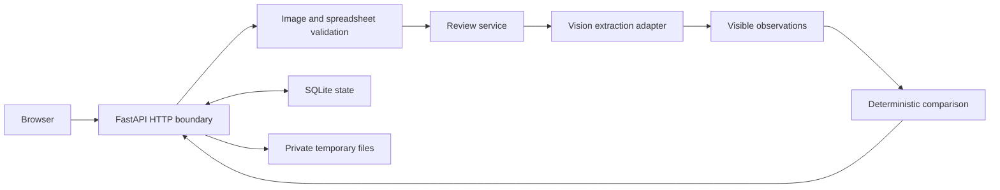

# Backend

**Status:** P0 and P1 implemented

**Last updated:** 2026-08-12

## Responsibilities

The Python backend serves the compiled interface, validates uploads, coordinates extraction,
performs deterministic comparison, manages short-lived batch work, and enforces the operational
limits on the public demo. The browser and the model provider never communicate directly.

[`app.main.create_app`](../app/main.py) assembles these boundaries and owns their startup and
shutdown lifecycle. FastAPI receives HTTP input, Pydantic validates public and internal contracts,
Pillow prepares images, and SQLite coordinates usage accounting and bounded batch state.

## Review pipeline

P0 and every selected P1 case use the same review service:

1. validate expected application values;
2. stream and inspect the uploaded image within fixed limits;
3. decode, orient, strip metadata, and normalize it to PNG;
4. admit the submission and reserve provider capacity and cost;
5. extract structured visible observations;
6. compare those observations with the expected values; and
7. settle usage accounting and return five check results.

The model does not receive expected values. The extraction result is therefore evidence for the
comparison layer rather than the comparison itself. [`app.reviews.service`](../app/reviews/service.py)
owns orchestration; [`app.comparison`](../app/comparison) contains pure parsing, normalization, and
comparison functions.

## Deterministic comparison

| Check | Implemented rule |
| --- | --- |
| Brand | Normalize Unicode, whitespace, case, and apostrophe style; preserve material word differences |
| Class/type | Normalize Unicode, whitespace, and case; preserve material word differences and order |
| Alcohol content | Parse ABV and U.S. proof; convert with `ABV = proof / 2`; reject conflicts and unsupported forms |
| Net contents | Parse metric quantities and normalize liters to milliliters; compare exact quantities |
| Government Warning | Compare canonical wording after whitespace normalization and separately inspect heading capitalization and observable weight |

Multiple plausible candidates, unreadable evidence, conflicting statements, or indeterminate
warning style produce `Needs review`. A different readable numeric quantity produces `Mismatch`.
Only five `Match` results produce `All checks passed`. The comparison service never returns
`Approved` or `Rejected`.

Physical type size, characters per inch, and label affixation cannot be established from an
unscaled image. These limitations are attached to the Government Warning result rather than
silently treated as passing checks.

## Input and response boundaries

Image type is identified from bytes rather than filename or browser MIME type. The server accepts
one non-animated JPEG, PNG, or WebP per case, up to 10 MiB, 40 megapixels, and 6,000 pixels on either
side. Corrupt, empty, unsupported, oversized, animated, and decompression-bomb-scale inputs fail
before extraction.

Batch parsing adds fixed limits for spreadsheet size, expanded XLSX content, source-row span,
cell length, case count, image count, and aggregate multipart size. Formulas, external workbook
links, ambiguous filenames, and unsafe path-like filenames are rejected. Result CSV cells are
neutralized against spreadsheet-formula prefixes.

Public failures use bounded categories and messages. Provider payloads, stack traces, uploaded
content, private limits, and credentials are not returned to the browser. Correlation IDs connect
safe responses with content-free operational records.

## Reliability and cost controls

Live extraction is fail-closed unless the provider key and all private usage controls are present.
The accepted single-process deployment uses:

- a global extraction concurrency of two shared by P0 and P1;
- atomic daily-attempt and cumulative-cost reservations in SQLite;
- a separate reservation for the one permitted transient retry;
- idempotency keys for single reviews and batch starts;
- a short process-local source throttle for public abuse smoothing;
- a 12-second extraction deadline; and
- a server-side live-extraction switch.

Only connection failures and provider 5xx responses are eligible for one application-controlled
retry. Timeouts and rate limits are not automatically retried. Interrupted or otherwise
unsettled attempts retain their conservative reservation because provider billing may be unknown.

P1 work runs in background tasks owned by one process, while every case transition and result is
stored in SQLite. One case failure does not fail the batch. On restart, completed results remain
available until expiry; uncertain queued or processing work becomes `interrupted` and is never
silently replayed.

## Code map

- Application composition: [`app/main.py`](../app/main.py)
- Review orchestration: [`app/reviews/service.py`](../app/reviews/service.py)
- Usage and concurrency gate: [`app/reviews/attempts.py`](../app/reviews/attempts.py)
- Comparison rules: [`app/comparison`](../app/comparison)
- Image intake: [`app/storage/images.py`](../app/storage/images.py)
- Batch parsing and processing: [`app/batches`](../app/batches)
- HTTP routes and errors: [`app/api`](../app/api)

The HTTP surface is documented in [API](api.md), persistence in [Storage](storage.md), and provider
behavior in [Vision Extraction](vision-extraction.md).
