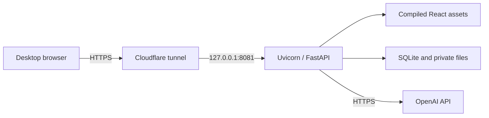

# Deployment

**Status:** P0 and P1 public and validated

**Last updated:** 2026-08-13

## Runtime topology

The public prototype is available at
[`https://label-review.mealcheck.dev`](https://label-review.mealcheck.dev). It runs as one native
Uvicorn process on an existing Intel MacBook Air that was already available for the
[MealCheck](https://github.com/chranama/MealCheck) project.

The `mealcheck.dev` domain is reused, but `label-review.mealcheck.dev` has its own route. The
Treasury process, port, releases, database, images, logs, and configuration are separate from
MealCheck. Only the existing cloudflared process and its additive ingress configuration are shared.

This shape was chosen because it was already available, inexpensive, and adequate for a short-lived
single-process demo. Docker would add another runtime and memory cost without improving isolation
on this host. It is not presented as a production government architecture.

## Fixed host contract

| Setting | Value |
| --- | --- |
| Listener | `127.0.0.1:8081` |
| Service label | `dev.mealcheck.label-review` |
| Application root | `/Users/chranama-server/treasury-takehome` |
| Data root | `/Users/chranama-server/treasury-takehome-data` |
| Runtime workers | One |
| Public ingress | Dedicated Cloudflare tunnel hostname |

The application root contains immutable `releases/<commit>` directories and an atomically selected
`current` symlink. The data root holds the protected environment, SQLite database, temporary
images, batch images, and bounded logs outside every release.

A system `launchd` service starts the application after reboot and restarts it after process
failure. The process runs as the existing server account. Application paths are isolated from
MealCheck, but that shared account is not an operating-system sandbox.

## Release process

[`deploy/macos/build-release.sh`](../deploy/macos/build-release.sh) refuses a dirty, unpushed, stale,
or non-`main` checkout. It runs the non-network backend, frontend, lint, build, and browser gates,
then packages tracked source, the lockfile, compiled assets, and the full commit identity into a
checksum-protected archive.

[`deploy/macos/deploy-release.sh`](../deploy/macos/deploy-release.sh) performs the deliberate
release operation:

1. confirm no review is active;
2. build and verify the release locally;
3. transfer it through a private staging directory;
4. verify its checksum and install locked Python dependencies;
5. atomically select the immutable release;
6. ask launchd to replace the old process; and
7. verify the exact commit, listener, health, and readiness.

Pushing `main` does not deploy it. This avoids an unattended paid endpoint update and keeps every
running build attributable to one explicit release decision. Exact operator commands and script
responsibilities are in [`deploy/macos/README.md`](../deploy/macos/README.md).

## Health, readiness, and logs

`GET /healthz` confirms that the process can answer. `GET /readyz` verifies local configuration,
schema version, SQLite access, and temporary storage without making a provider request. Live
extraction cannot become ready unless the API key and all private cost and throttle settings are
present.

Uvicorn access logging is disabled because its default line contains the client address. Error and
service logs rotate at 1 MiB with five archives; a separate startup log rotates at 256 KiB with two
archives. Files inherit private permissions. The SQLite ledger—not logs—is authoritative for
attempt, timing, token, cost, and outcome metadata.

The public P0 service has passed local and HTTPS health/readiness checks, controlled service restart,
host reboot recovery, same-origin browser inspection, and live matching, mismatch, and unreadable
smoke cases. After reboot, public service recovery succeeded even though the Tailscale management
session did not return until local user login; that affects remote administration, not public
availability.

## Network boundary

The Uvicorn listener is localhost-only. The browser loads scripts, styles, downloads, and APIs from
the application origin and requires no VPN or applicant-controlled credentials. The browser has no
direct provider, storage, analytics, telemetry, CDN, font, or authentication dependency. The only
required backend runtime destination is `api.openai.com`.

HTML responses use a same-origin Content Security Policy and `Cache-Control: no-transform` to
prevent browser runtime injection. Trusted Cloudflare client-address handling is enabled only when
the origin is confirmed to be reachable exclusively through the tunnel.

## P1 rollout evidence

P1 was deployed from clean commit `15f0a5e343f50cf1dde985d412603dc3860adc43` on August 13,
2026. The rollout disabled paid starts during activation, applied the additive schema-2 migration,
verified P0 first, and ran mixed preflight without a provider call before re-enabling extraction.
Because the earlier P0 binary does not own P1 cleanup correctly after migration, this remains a
forward-only transition: a defect requires a tested forward fix rather than restarting that binary
against schema 2.

Public validation covered expected-value correction, row-specific image replacement, duplicate
start idempotency, polling, case detail, CSV export, refresh recovery, and one live batch containing
a match, known mismatch, and unreadable case. A separate 25-case synthetic batch completed under
the two-request concurrency ceiling. All 28 processed images were deleted immediately. A controlled
service restart preserved completed results and created no additional provider attempt.

## Limitations

The deployment has no uptime SLA, authentication, dedicated service account, multi-host failover,
managed queue, FedRAMP authorization, government records controls, or demonstrated Treasury
allowlisting. It is an attributable evaluated prototype, not a production TTB service.
