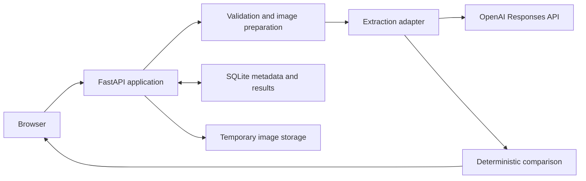

# Implementation Approach

**Status:** Accepted architecture; implementation and measurements in progress
**Last updated:** 2026-08-10

## Approach

The prototype separates probabilistic visual extraction from deterministic comparison. A hosted multimodal model reports what is visible on the label; application code owns normalization, field comparison, warning verification, and the overall reviewer-assist outcome.

The model does not receive the manually entered expected values. This reduces the risk that it will echo or become anchored by the expected answer. The model may return multiple visible candidates or an explicit unreadable or uncertain observation rather than selecting the candidate that appears most likely to match.

The application remains a review aid. It does not approve or reject a COLA or replace reviewer judgment.

## System shape



The browser communicates only with the application origin. It does not call OpenAI, external storage, analytics, public CDNs, or third-party font services. The backend serves the compiled frontend and `/api/*` routes from the same origin.

## Tools

| Area | Choice |
| --- | --- |
| Backend | Python 3.12, FastAPI, Pydantic v2 |
| Provider client | Official OpenAI Python SDK and Responses API |
| Image handling | Pillow |
| Batch parsing | `openpyxl` for XLSX and the Python standard library for CSV |
| Local state | SQLite |
| Frontend | React, TypeScript, and Vite |
| Python workflow | `uv`, Ruff, and `pytest` |
| Frontend tests | Vitest and Playwright |
| Deployment | Uvicorn, `launchd`, and a Cloudflare tunnel |

The initial extraction baseline is `gpt-5.6-luna` because it accepts image input, supports structured output, and is intended for cost-sensitive workloads. This is a baseline rather than a claim that the model has already passed the project fixture evaluation. If another model replaces it, that model will be evaluated as one explicit global configuration; the application will not silently escalate individual cases to a more expensive provider configuration.  The prototype will not have a model routing component.

## Review lifecycles

### Single review

P0 uses one synchronous application request:

```text
validate input
  -> reserve provider capacity
  -> prepare image
  -> extract structured observations
  -> compare deterministically
  -> return result
```

The extraction work has a bounded total deadline. At most one application-controlled retry may occur for a narrowly defined transient failure, and all attempts are included in usage accounting.

### Batch review

P1 accepts an XLSX workbook or UTF-8 CSV plus multiple label images. ZIP input is not part of the initial implementation.

The backend creates a short-lived preflight draft that identifies invalid rows, missing or duplicate images, duplicate application IDs, unsupported files, and batches over 25 cases. The reviewer can correct expected values or replace image associations before starting the ready cases.

Started batches run as short-lived background jobs. The browser polls for progress; WebSockets and server-sent events are unnecessary for this bounded prototype. Every case uses the P0 extraction and comparison pipeline independently, so one case failure does not fail the batch. A browser-generated idempotency key prevents a repeated start request from creating duplicate provider calls.

## Extraction and comparison boundary

The provider receives one normalized label image and stable extraction instructions. It does not receive expected application values, the source spreadsheet, filenames, comparison results, or other batch cases.

The structured response represents observations rather than compliance conclusions, including:

- visible candidates for brand, class/type, alcohol statements, and net contents;
- exact visible Government Warning text;
- warning-heading capitalization and observable text weight;
- explicit visibility and readability states; and
- a short uncertainty explanation when needed.

The extraction adapter validates that response into Pydantic models. Pure application functions then normalize and compare values, detect ambiguity or conflicting candidates, check warning wording and observable style, and derive `All checks passed`, `Needs review`, or `Unable to process`.

Tests can replace the hosted adapter with fixed responses. This keeps domain behavior testable without network access or API spend.

When an image is unreadable or uncertain, the result explains the affected check and recommends a clearer resubmission rather than guessing a value.

## Input security

The backend identifies image content from file bytes rather than trusting the filename or browser MIME type. It fully decodes the image, applies EXIF orientation, rejects corrupt or animated content, bounds decoded dimensions, strips metadata from the provider-bound representation, and preserves readable pixels unless a maximum dimension requires resizing.

The initial accepted limits are JPEG, PNG, or WebP; 10 MB per image; no more than 40 megapixels or 6,000 pixels on either side; and one image or composite per case. The decoded-dimension limits remain subject to fixture and memory testing before they are presented as final measured settings.

Batch filename matching is Unicode-normalized and case-insensitive for convenience, while ambiguous collisions are rejected. Result CSV generation neutralizes spreadsheet-formula prefixes in user-derived cells.

## Data handling and retention

The interface requires synthetic or otherwise non-sensitive data. This prototype is not designed for PII, protected government records, or production TTB applications.

Local handling follows these rules:

- P0 expected values exist for the request and result only; the uploaded image is deleted immediately after extraction succeeds or fails.
- A raw XLSX or CSV file is deleted after successful preflight parsing.
- P1 expected values, structured results, idempotency records, and draft metadata may remain in SQLite for browser refresh, but expire within 24 hours.
- P1 images are deleted individually after their extraction attempt; unused draft images expire within 24 hours.
- Invalid uploads are deleted without a provider call.
- Startup and periodic cleanup remove expired records and orphaned temporary files.
- Application content directories are excluded from backups.
- Images, filenames, expected values, extracted text, prompts, source IP addresses, and provider payloads are not written to application logs.
- Operational records contain only correlation IDs, provider request IDs, model configuration, timings, token usage, estimated cost, result-category counts, and bounded error classes.

Batch identifiers are unguessable, and the application does not provide an endpoint for listing other users' batches.

OpenAI receives the normalized image and extraction instructions through the Responses API. The implementation uses `store: false` and does not create an OpenAI File object, conversation, or background response for a review. Under [OpenAI's current API data controls](https://developers.openai.com/api/docs/guides/your-data#default-usage-policies-by-endpoint), API data is not used to train or improve models unless the account owner explicitly opts in. Standard abuse-monitoring logs may nevertheless contain customer content and may be retained for up to 30 days. This project does not claim that its API project has Zero Data Retention or special data-residency controls.

## Cost and reliability controls

Each label normally produces one provider request. P1 reuses that same per-case path rather than sending a whole batch to one model request.

The deployed application bounds spend and request bursts through:

- a maximum of 25 ready cases per batch;
- global extraction concurrency of two;
- atomic usage reservation before an extraction or batch starts;
- a separate reservation for any retry;
- a durable daily global attempt allowance and cumulative cost ceiling;
- per-submission idempotency;
- a loose source-IP submission throttle for abuse smoothing, not client identity;
- fixed model and output limits; and
- a server-side live-extraction kill switch.

Exact financial budgets and abuse thresholds are deployment configuration rather than public repository values. If live extraction is unavailable because a guard is reached, the application keeps its static interface and clearly identified sample results available; it never presents a stored or fake result as a newly processed review.

The application records provider-reported token usage, latency, and estimated cost without logging uploaded content. Model and image-detail choices will be compared on representative fixtures using correctness, uncertainty behavior, latency, and cost together. Measured median and upper-percentile cost will be added after the evaluation is repeatable; provisional estimates are not reported as observed results.

## Testing and evaluation

The test strategy has four layers:

1. unit tests for normalization, proof conversion, unit conversion, warning comparison, ambiguity, and status aggregation;
2. backend integration tests for validation, APIs, SQLite reservations, idempotency, batch isolation, and error mapping with a fixed extraction adapter;
3. frontend and browser tests for form behavior, preflight correction, progress, filtering, downloads, and accessibility basics; and
4. an explicitly invoked live-provider evaluation over synthetic fixtures.

Ordinary automated tests make no external model calls. The live evaluation records its model, image-detail setting, fixture set, correctness, uncertainty handling, malformed-response rate, latency, token usage, and estimated cost.

A deployed smoke test will complete the P0 happy path in a current desktop browser and verify that browser runtime requests do not depend on third-party asset, model, storage, analytics, telemetry, or authentication domains.

The initial quality gates are conservative: known material mismatches and altered warnings must not match; missing or unreadable values must not be invented; the supplied clear fixture must complete all five checks; and one failed case must not fail a batch.

Performance results will be added after at least 10 consecutive warm runs. Browser upload time and any deployment cold-start effect will be reported separately from server processing time.

## Deployment and network assumptions

The production-shaped demo will run at [`https://label-review.mealcheck.dev`](https://label-review.mealcheck.dev) as one Uvicorn process in a project-owned Python 3.12 environment on an existing macOS host. That host was already available for the deployed [MealCheck project](https://github.com/chranama/MealCheck), so reusing it avoids provisioning another server for a short-lived prototype and builds on an established macOS deployment path. The `mealcheck.dev` domain is likewise reused from MealCheck, while the dedicated `label-review` subdomain gives this application its own HTTPS route and keeps it distinct from MealCheck's frontend and API.

A dedicated `launchd` service will start and restart the application. A dedicated Cloudflare tunnel route will expose the localhost-only service over HTTPS. Docker is not required on the deployment host, and Node is used only to build the frontend.

The browser-visible origin will supply all P0 runtime assets and API routes. The backend's required external runtime dependency is OpenAI at `api.openai.com`. Health and readiness endpoints will check local process, configuration, and database state without making a model request.

This deployment is appropriate for an evaluated prototype, not a production government service. It has no uptime SLA, authentication, FedRAMP authorization, government records-management controls, or demonstrated Treasury allowlisting. The public deployment will identify temporary provider or capacity failures rather than exposing configuration details or stack traces.

## Assumptions and tradeoffs

- P0 is the required polished workflow; P1 is a bounded demonstration.
- The prototype covers the supplied distilled-spirits fields, not complete beverage-specific rule engines.
- One image or composite represents the relevant artwork for one case.
- XLSX or CSV plus images is favored over ZIP because it is more usable for a nontechnical reviewer and avoids archive-specific security complexity.
- SQLite is sufficient for short-lived prototype state and durable cost accounting; production queue persistence and multi-worker coordination are out of scope.
- Polling is simpler than a streaming transport for a 25-case job.
- A hosted multimodal model is favored over a local model because implementation time and extraction quality are the primary constraints.
- Physical type size, characters per inch, and label affixation cannot be established reliably from an unscaled image.
- Model selection, image detail, exact decoded-image limits, latency, and cost remain subject to repeatable fixture evidence.
