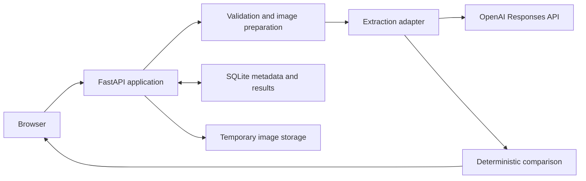

# Implementation Approach

**Status:** P0 deployed and validated; P1 implemented with public rollout pending
**Last updated:** 2026-08-12

## Approach

The prototype separates probabilistic visual extraction from deterministic comparison. A hosted multimodal model reports what is visible on the label; application code owns normalization, field comparison, warning verification, and the overall reviewer-assist outcome.

The model does not receive the manually entered expected values. This reduces the risk that it will echo or become anchored by the expected answer. The model may return multiple visible candidates or an explicit unreadable or uncertain observation rather than selecting the candidate that appears most likely to match.

The application remains a review aid. It does not approve or reject a COLA or replace reviewer judgment.

## System shape



The browser communicates only with the application origin. It does not call OpenAI, external storage, analytics, public CDNs, or third-party font services. The backend serves the compiled frontend and `/api/*` routes from the same origin. HTML responses use `Cache-Control: no-transform` to prevent edge injection and a Content Security Policy that permits runtime scripts, styles, connections, fonts, and forms only from the application origin; local image previews additionally permit browser-generated `blob:` and `data:` URLs.

## Tools

| Area | Choice |
| --- | --- |
| Backend | Python 3.12, FastAPI, Pydantic v2 |
| Provider client | Official OpenAI Python SDK and Responses API |
| Image handling | Pillow |
| Batch parsing | `openpyxl` for XLSX and the Python standard library for CSV |
| Local state | SQLite |
| Frontend | React, TypeScript, and Vite |
| Python workflow | `uv`, Ruff, and `pytest` |
| Frontend tests | Vitest and Playwright |
| Deployment | Uvicorn, `launchd`, and a Cloudflare tunnel |

The evaluated extraction baseline is `gpt-5.6-luna` at `high` image detail on the Standard service tier because it accepts image input, supports structured output, met the synthetic fixture gate, and remained the better latency/cost tradeoff in the Standard-versus-Fast comparison. If another model replaces it, that model will be evaluated as one explicit global configuration; the application will not silently escalate individual cases to a more expensive provider configuration. The prototype does not have a model-routing component.

## Review lifecycles

### Single review

P0 uses one synchronous application request:

```text
validate input
  -> prepare image
  -> reserve provider capacity
  -> extract structured observations
  -> compare deterministically
  -> return result
```

The extraction work has a bounded total deadline. At most one application-controlled retry may occur for a narrowly defined transient failure, and all attempts are included in usage accounting.

### Batch review

P1 accepts an XLSX workbook or UTF-8 CSV plus multiple label images. ZIP input is not part of the initial implementation.

The backend creates a short-lived preflight draft that identifies invalid rows, missing or duplicate images, duplicate application IDs, unsupported files, and batches over 25 cases. The reviewer can correct expected values or replace image associations before starting the ready cases.

Started batches run as short-lived background jobs. The browser polls for progress; WebSockets and server-sent events are unnecessary for this bounded prototype. Every case uses the P0 extraction and comparison pipeline independently, so one case failure does not fail the batch. A browser-generated idempotency key prevents a repeated start request from creating duplicate provider calls.

P1 advances SQLite from schema version 1 to version 2 through an additive, idempotent migration.
Because the P0 binary does not preserve schema version 2 or clean P1 content, the first P1 rollout
is a forward-only transition: a deployment problem is handled with a tested forward fix rather
than by restarting the P0 binary against the migrated database.

## Extraction and comparison boundary

The provider receives one normalized label image and stable extraction instructions. It does not receive expected application values, the source spreadsheet, filenames, comparison results, or other batch cases.

The structured response represents observations rather than compliance conclusions, including:

- visible candidates for brand, class/type, alcohol statements, and net contents;
- exact visible Government Warning text;
- warning-heading capitalization and observable text weight;
- explicit visibility and readability states; and
- a short uncertainty explanation when needed.

The extraction adapter validates that response into Pydantic models. Pure application functions then normalize and compare values, detect ambiguity or conflicting candidates, check warning wording and observable style, and derive `All checks passed`, `Needs review`, or `Unable to process`.

The hosted adapter uses the Responses API structured-output parser to validate directly against the shared Pydantic observation schema. Its stable `label-observations-v2` instructions are sent separately from a user message containing one normalized image as an in-memory data URL. The request uses `gpt-5.6-luna`, `detail: high`, no tools, `reasoning.effort: none`, `store: false`, and a 1,000-token output ceiling. The instructions reserve `not_visible` for absence supported by usable image quality; image degradation that prevents that determination is reported as uncertainty.

Both the provider request and the complete review operation are bounded by the 12-second extraction deadline. The provider adapter and SDK each perform exactly one attempt. The review service permits one short retry only for a connection failure or provider 5xx response, and it obtains a separate durable reservation before that retry. It does not automatically retry a timeout or rate-limit response. Provider exceptions are converted to the bounded extraction-error contract without returning provider payloads to the browser.

Tests can replace the hosted adapter with fixed responses. This keeps domain behavior testable without network access or API spend.

When an image is unreadable or uncertain, the result explains the affected check and recommends a clearer resubmission rather than guessing a value.

## Input security

The backend identifies image content from file bytes rather than trusting the filename or browser MIME type. It fully decodes the image, applies EXIF orientation, rejects corrupt or animated content, bounds decoded dimensions, strips metadata from the provider-bound representation, and preserves readable pixels unless a maximum dimension requires resizing.

The initial accepted limits are JPEG, PNG, or WebP; 10 MB per image; no more than 40 megapixels or 6,000 pixels on either side; and one image or composite per case. The decoded-dimension limits remain subject to fixture and memory testing before they are presented as final measured settings.

Batch filename matching is Unicode-normalized and case-insensitive for convenience, while ambiguous collisions are rejected. Result CSV generation neutralizes spreadsheet-formula prefixes in user-derived cells.

## Data handling and retention

The interface requires synthetic or otherwise non-sensitive data. This prototype is not designed for PII, protected government records, or production TTB applications.

Local handling follows these rules:

- P0 expected values exist for the request and result only; the uploaded image is deleted immediately after extraction succeeds or fails.
- A raw XLSX or CSV file is deleted after successful preflight parsing.
- P1 expected values, structured results, idempotency records, and draft metadata may remain in SQLite for browser refresh, but expire within 24 hours.
- P1 images are deleted individually after their extraction attempt; unused draft images expire within 24 hours.
- Invalid uploads are deleted without a provider call.
- Startup and periodic cleanup remove expired records and orphaned temporary files.
- Application content directories are excluded from backups.
- Images, filenames, expected values, extracted text, prompts, source IP addresses, and provider payloads are not written to application logs.
- Operational records contain only correlation IDs, provider request IDs, model configuration, timings, token usage, estimated cost, result-category counts, and bounded error classes.

Batch identifiers are unguessable, and the application does not provide an endpoint for listing other users' batches.

OpenAI receives the normalized image and extraction instructions through the Responses API. The implementation uses `store: false` and does not create an OpenAI File object, conversation, or background response for a review. Under [OpenAI's current API data controls](https://developers.openai.com/api/docs/guides/your-data#default-usage-policies-by-endpoint), API data is not used to train or improve models unless the account owner explicitly opts in. Standard abuse-monitoring logs may nevertheless contain customer content and may be retained for up to 30 days. This project does not claim that its API project has Zero Data Retention or special data-residency controls.

## Cost and reliability controls

Each label normally produces one provider request. P1 reuses that same per-case path rather than sending a whole batch to one model request.

The deployed application bounds spend and request bursts through:

- a maximum of 25 ready cases per batch;
- global extraction concurrency of two;
- atomic usage reservation before an extraction or batch starts;
- a separate reservation for any retry;
- a durable daily global attempt allowance and cumulative cost ceiling;
- per-submission idempotency;
- a loose source-IP submission throttle for abuse smoothing, not client identity;
- fixed model and output limits; and
- a server-side live-extraction kill switch.

These controls are implemented by a SQLite ledger and a two-slot in-process concurrency guard for the accepted single-Uvicorn-process deployment. Each provider attempt is inserted under an immediate SQLite transaction only after the daily attempt and cumulative reserved-cost checks pass. A successful response replaces its conservative reservation with provider-reported estimated cost; an attempt without usage retains the reservation because it may still have been billed. Startup marks interrupted submissions and reservations as failed while preserving their reserved cost.

The browser supplies a new idempotency key for each explicit review submission. Only its SHA-256 digest is stored. Reuse never creates another provider attempt; because the application deliberately does not retain expected or extracted values, a completed response is not replayed and the duplicate receives a safe conflict response. Source-IP throttling uses only a process-local, secret-salted digest that resets on restart. `CF-Connecting-IP` is trusted only under an explicit deployment setting for a service reachable exclusively through the Cloudflare tunnel.

Exact financial budgets and abuse thresholds are private deployment configuration rather than public repository values, and readiness fails when live extraction is enabled without them. If live extraction is unavailable because a guard is reached, the application keeps its static interface and clearly identified sample results available; it never presents a stored or fake result as a newly processed review.

The application records provider-reported token usage, latency, and estimated cost without logging uploaded content. Model and image-detail choices are evaluated on representative fixtures using correctness, uncertainty behavior, latency, and cost together. Provisional estimates are not reported as observed results.

## Testing and evaluation

The test strategy has four layers:

1. unit tests for normalization, proof conversion, unit conversion, warning comparison, ambiguity, and status aggregation;
2. backend integration tests for validation, APIs, SQLite reservations, idempotency, batch isolation, and error mapping with a fixed extraction adapter;
3. frontend and browser tests for form behavior, preflight correction, progress, filtering, downloads, and accessibility basics; and
4. an explicitly invoked P0 live-provider evaluation over synthetic fixtures.

Ordinary automated tests make no external model calls. The P0 live evaluation records its model, image-detail setting, fixture set, correctness, uncertainty handling, malformed-response rate, latency, token usage, and estimated cost.

On August 11, 2026, three unchanged `gpt-5.6-luna` runs at `high` detail passed all 12 versioned synthetic cases with no malformed responses or retries. The clear label passed all five checks; the known net-contents and warning alterations were detected every time; and the unreadable fixture produced uncertainty without fabricated text. Median latency was 2.70 seconds and the slowest request was 8.55 seconds. Estimated per-case cost was $0.000360 at the median and $0.000903 at the nearest-rank 95th percentile under pricing checked that day. These results support a prototype baseline only; the fixture set is small and synthetic, and the latency outlier still requires deployed-path validation.

A paired follow-up compared 40 Standard and 40 [Fast-mode](https://developers.openai.com/api/docs/guides/fast-mode) requests using the same model, prompt, detail, and four fixtures. Standard passed 40/40 with 2.09-second median, 3.19-second p95, and 4.75-second maximum latency. Fast completed and passed 39/40; its successful requests had a 1.70-second median but a 3.77-second p95 and 7.68-second maximum, while the remaining request reached the 12-second application deadline. Fast therefore reduced median latency by 18.6% but did not improve the observed tail, and its per-success median cost was approximately twice Standard. The deployment default remains Standard; Fast is an explicit configuration option rather than an automatic fallback. These small synthetic samples do not establish a production latency distribution.

The frozen `live-evaluation-v1` manifest defines four deterministic baseline cases. The expanded `hosted-visual-v2` manifest defines 18 cases across layout, field variation, ambiguity, warning wording and style, degradation, rotation, small text, and image dimensions. Artwork is generated locally, hash-checked before provider access, and evaluated first as visible observations and then through deterministic comparison. The evidence report records the manifest hash and prompt revision so a later result is attributable to one configuration. The explicitly invoked `evals.live` and `evals.tier_benchmark` commands are the only documented evaluation paths that intentionally incur provider charges. The accepted configuration uses `high` image detail; `original` remains an explicit follow-up only if warning transcription at `high` fails.

The accepted `live-evaluation-v1` manifest remains frozen for historical attribution. On August 12, 2026, the Standard-tier Luna configuration passed all 18 required `hosted-visual-v2` observation and correctness gates after independently reviewed ground-truth corrections. The accepted paid pass had no timeout, retry, malformed response, or provider error; median latency was 2.00 seconds and nearest-rank p95 and maximum were 2.89 seconds, with estimated provider cost of $0.014103. The sample is synthetic and too small to establish commercial-label accuracy or a production latency distribution. [Fixture Coverage and Manifest Contract](fixture-coverage.md) records the suite, evaluator boundary, diagnostic correction, and limitations.

Raw evaluation evidence remains local and gitignored because it contains diagnostic observations and provider request identifiers. Hosted extraction remains disabled by default and cannot become ready until the API key and all private usage-control settings are present.

P1 package regression is entirely offline. The `p1-packages-v1` revision generates 18 CSV/XLSX,
preflight, correction, processing, export, cleanup, and restart cases with 121 artifact hashes.
Reproducible binaries remain uncommitted. The 25-case fixed-response case verifies independent
match, mismatch, unreadable, and failure outcomes under concurrency two; restart evidence verifies
that uncertain work is interrupted without replay.

When live extraction is disabled, P1 preflight drafts and existing results remain available, but
starting a batch is rejected before it can be queued. This supports a maintenance window without
turning every case into a failed provider attempt.

The implemented P1 workflow applies this same extraction boundary independently to as many as 25
ready cases. It adds bounded CSV/XLSX preflight, short-lived corrections and image associations,
idempotent background start, global concurrency two, refresh-safe polling and case detail, safe CSV
export, immediate deletion of processed images, and deletion of unused content within 24 hours.
Fixed-response regression covers mixed 25-case execution, independent failures, restart
interruption without replay, request limits, content-free operational records, cleanup, and the
two-page single/batch browser workflow. The bounded P1 live-provider batch is deliberately deferred
to the deployment plan so it measures the merged, attributable release through the deployed path.

P1 does not add authentication, reviewer accounts or roles, audit history, durable cross-process
queue resume, official COLAs Online integration, automatic approval or rejection, long-term result
history, or evidence of production throughput for 200-300-application stakeholder batches.

A deployed smoke test will complete the P0 happy path in a current desktop browser and verify that browser runtime requests do not depend on third-party asset, model, storage, analytics, telemetry, or authentication domains.

The initial quality gates are conservative: known material mismatches and altered warnings must not match; missing or unreadable values must not be invented; the supplied clear fixture must complete all five checks; and one failed case must not fail a batch.

On August 12, 2026, the public deployment passed matching, net-contents-mismatch, and unreadable synthetic smoke cases. A subsequent series of 10 consecutive warm matching reviews passed 10/10 with no retries, timeouts, or malformed responses. Server-reported processing time was 2.59 seconds at the median and 4.32 seconds at both the nearest-rank 95th percentile and maximum; with only 10 observations, that percentile is the slowest result rather than a stable tail estimate. The command-line public harness measured 3.45 seconds at the median and 5.15 seconds at the maximum end to end, including client startup, fixture preparation, upload, and response handling. The small synthetic upload was not material enough to isolate as a separate browser-upload measurement. An earlier first matching request took 9.61 seconds server-side even though the process was already healthy, so it is reported as an observed provider-path outlier rather than attributed to application cold start.

Across the 21 scripted D3 public attempts, all provider attempts succeeded without retry. Estimated provider cost was $0.009145 in aggregate. For the unchanged 10-run warm series, estimated per-case cost was $0.000361 at both the median and nearest-rank 95th percentile under the same August 11 pricing snapshot. Two deliberately rapid additional submissions were rejected by the source throttle before provider access, demonstrating that the public abuse control does not consume model capacity. A final current-Chrome review uploaded the 87 KB synthetic fixture and returned five matches in 6.03 seconds; browser inspection observed only the same-origin compiled script, stylesheet, and `/api/reviews` request, with no third-party runtime resource or console warning. These measurements use one deterministic synthetic fixture on a short prototype run and do not establish a production latency or cost distribution.

## Deployment and network assumptions

The production-shaped demo runs at [`https://label-review.mealcheck.dev`](https://label-review.mealcheck.dev) as one Uvicorn process in a project-owned Python 3.12 environment on an existing macOS host. That host was already available for the deployed [MealCheck project](https://github.com/chranama/MealCheck), so reusing it avoids provisioning another server for a short-lived prototype and builds on an established macOS deployment path. The `mealcheck.dev` domain is likewise reused from MealCheck, while the dedicated `label-review` subdomain gives this application its own HTTPS route and keeps it distinct from MealCheck's frontend and API.

A dedicated `launchd` service starts and restarts the application. A dedicated Cloudflare tunnel route exposes the localhost-only service over HTTPS. Docker is not required on the deployment host, and Node is used only to build the frontend.

The browser-visible origin supplies all P0 runtime assets and API routes. The backend's required external runtime dependency is OpenAI at `api.openai.com`. Health and readiness endpoints check local process, configuration, and database state without making a model request.

This deployment is appropriate for an evaluated prototype, not a production government service. It has no uptime SLA, authentication, FedRAMP authorization, government records-management controls, or demonstrated Treasury allowlisting. The public deployment identifies temporary provider or capacity failures rather than exposing configuration details or stack traces.

## Assumptions and tradeoffs

- P0 is the required polished workflow; P1 is a bounded demonstration.
- The prototype covers the supplied distilled-spirits fields, not complete beverage-specific rule engines.
- One image or composite represents the relevant artwork for one case.
- XLSX or CSV plus images is favored over ZIP because it is more usable for a nontechnical reviewer and avoids archive-specific security complexity.
- SQLite is sufficient for short-lived prototype state and durable cost accounting; production queue persistence and multi-worker coordination are out of scope.
- Polling is simpler than a streaming transport for a 25-case job.
- A hosted multimodal model is favored over a local model because implementation time and extraction quality are the primary constraints.
- Physical type size, characters per inch, and label affixation cannot be established reliably from an unscaled image.
- Model selection, image detail, exact decoded-image limits, latency, and cost remain subject to repeatable fixture evidence.
