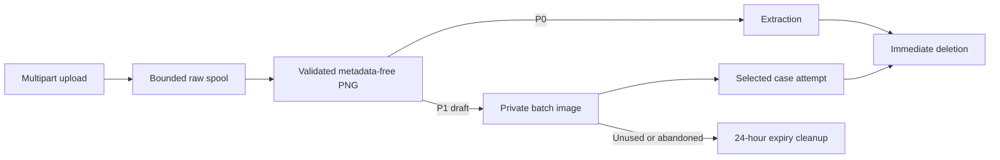

# Storage

**Status:** Schema version 2 implemented

## Data classes

The application separates short-lived review content from content-free operational accounting.
SQLite stores both classes in different tables; image bytes remain in private files.

| Data | Location | Lifetime |
| --- | --- | --- |
| P0 raw and normalized image | Private temporary directory | Deleted when the request succeeds or fails |
| P0 expected and extracted values | Request memory | Not persisted |
| P1 raw spreadsheet and upload spools | Private temporary directory | Deleted after preflight or validation failure |
| P1 normalized images | Private batch-image directory | Deleted after each processing attempt or within 24 hours |
| P1 expected values, issues, state, and results | SQLite content tables | At most 24 hours from draft creation |
| Submission and provider accounting | SQLite operational tables | Content-free project record |
| Browser batch reference | URL query string | Controlled by the browser; contains only a UUID |

The application is designed for synthetic or otherwise non-sensitive demo data. It is not a
records system and is not configured for PII or protected government applications.

## SQLite schema

[`app/db.py`](../app/db.py) creates the operational schema and transactionally applies the additive
batch migration in [`app/batches/schema.py`](../app/batches/schema.py).

| Table | Responsibility | Content-bearing |
| --- | --- | --- |
| `review_submissions` | Idempotency digest, correlation ID, terminal category, and check counts | No |
| `provider_attempts` | Reservation, settlement, provider request ID, configuration, tokens, latency, and cost | No |
| `batch_reviews` | Batch lifecycle, expiry, selection, and start-key digest | Yes |
| `batch_images` | Random storage key, bounded image metadata, expiry, and cleanup state | Yes |
| `batch_cases` | Expected values, issues, processing state, safe failure, and correlation | Yes |
| `batch_case_results` | Temporary structured comparison result | Yes |

Foreign keys are enabled on every connection. Batch deletion cascades through cases and results;
image files are reconciled separately because SQLite does not own filesystem transactions.

Usage reservations use immediate SQLite transactions so concurrent requests cannot each spend the
same remaining budget. A successful provider response replaces its reservation with estimated
provider-reported cost. If billing is unknown, the reservation remains charged conservatively.

## Image lifecycle

Raw filenames never determine a filesystem path. Temporary names and P1 storage keys are random;
batch and case identities are UUIDv4 values. Image directories are mode `0700` and normalized image
files inherit private permissions. The normalized provider-bound file contains readable pixels but
not source EXIF, PNG text, or color-profile metadata.

Only valid images associated with a row are copied into a draft. Ambiguous, duplicate, invalid,
and unreferenced inputs remain preflight-owned and are deleted when preflight exits. Replacing a
case image writes the new file before changing the association, then removes the old file.

## Expiry and recovery

Batch expiry is absolute: 24 hours from draft creation. Retrieval, polling, correction, and image
replacement do not extend it. Startup and a task running at least every five minutes remove expired
records and reconcile orphaned files.

Processed-image deletion is attempted on every terminal path. A failed unlink records only a
bounded error category, attempt count, and timestamp, then cleanup retries it. Filenames and raw
filesystem errors are not copied into cleanup bookkeeping.

An orderly shutdown drains active batch work for up to 15 seconds. Startup preserves completed
results, reconciles incomplete usage reservations, marks uncertain queued or processing cases
`interrupted`, and deletes images whose provider state is uncertain. It never replays a provider
attempt automatically.

## Logging and backups

Normal logs omit images, filenames, expected values, extracted text, warning text, prompts, source
addresses, provider payloads, and credentials. Operational records are limited to correlation and
provider request IDs, model configuration, timing, token usage, estimated cost, result-category
counts, and bounded error classes.

The deployment keeps the database, temporary images, batch images, logs, and environment outside
immutable releases. Content-bearing application directories are excluded from general-purpose
backup and synchronization because backup retention would conflict with the 24-hour deletion
contract.

Batch identifiers are unguessable and the API has no collection or list endpoint, but the public
prototype has no authentication or per-user authorization. UUID secrecy is a bounded demo control,
not an access-control system.

Provider-side handling is documented in [Vision Extraction](vision-extraction.md); application
runtime placement and permissions are documented in [Deployment](deployment.md).
