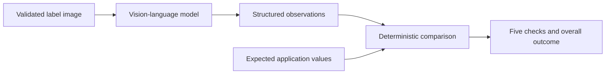

# Vision Extraction

**Status:** Hosted extraction implemented and evaluated

## Boundary

The vision-language model reports visible evidence; it does not decide whether a label matches an
application or complies with regulation. Expected application values, comparison results, source
spreadsheet content, filenames, and other batch cases are never included in the provider request.

This separation limits anchoring: the model cannot echo an expected answer it never received.
[`ExtractionAdapter`](../app/extraction/contract.py) is provider-neutral, so tests can supply fixed
observations without network access or model spend.

## Observation contract

The structured response contains:

- every distinct plausible brand, class/type, alcohol, and net-contents candidate;
- visibility and readability for each field;
- complete visible Government Warning text and heading;
- observable heading and body weight; and
- a short note limited to visual evidence.

Candidates remain verbatim. Multiple candidates remain multiple candidates. Missing, hidden,
degraded, or unreadable evidence remains absent or uncertain rather than being filled by inference.
The contract does not contain compliance, match, approval, rejection, or numeric-confidence fields.

`not_visible` is reserved for absence supported by usable image quality. When blur, cropping,
obstruction, glare, or resolution prevents that determination, the model must return uncertain
visibility and unreadable or uncertain readability.

## Provider request

The deployed adapter in [`app/extraction/openai_adapter.py`](../app/extraction/openai_adapter.py)
uses the OpenAI Responses API structured-output parser with the shared Pydantic observation model.

| Setting | Accepted configuration |
| --- | --- |
| Model | `gpt-5.6-luna` |
| Prompt revision | `label-observations-v2` |
| Image detail | `high` |
| Service tier | Standard (`default`) |
| Reasoning effort | `none` |
| Output ceiling | 1,000 tokens |
| Provider timeout | 12 seconds |
| Tools | None |
| Provider storage request | `store: false` |

The metadata-free normalized PNG is read in memory and sent as a data URL. The adapter does not
create an OpenAI File, conversation, or background response. The response is accepted only when
the provider reports completion and its parsed output validates against the observation schema.

The application records content-free request metadata: provider request ID, returned model,
prompt revision, image detail, requested and returned service tier, latency, tokens, and estimated
cost. It does not log the image, prompt, expected values, candidates, warning text, or provider
payload.

## Failure and retry behavior

Provider exceptions are mapped to stable, provider-neutral categories. A connection failure or
provider 5xx may receive one application-controlled retry after a separate cost reservation. A
timeout, rate limit, authentication problem, invalid request, content-filter finish, length finish,
or malformed structured output is not retried automatically.

The adapter and SDK each make one attempt; the review service owns the only possible retry. Both
the provider request and complete extraction section are bounded by the 12-second application
deadline. The browser receives an actionable safe category without a provider payload.

## Model and architecture choices

A hosted multimodal model was selected because the available macOS host cannot run a capable vision
model within the desired latency and implementation window. A local model would also move model
packaging, memory pressure, startup, and quality evaluation into the prototype's critical path.

The implementation makes one extraction call per label. It does not add a separate OCR stage,
crop router, ensemble, per-case model escalation, or fallback provider. Those additions would add
latency, cost, and new failure boundaries without evidence that the accepted configuration needs
them. Model, detail, and service tier are global explicit settings rather than hidden case-by-case
routing decisions.

Standard service was retained after a paired benchmark. Fast reduced median latency but did not
improve the observed tail, had one deadline failure, and approximately doubled median cost per
successful case. Full measurements and fixture limitations are in [Evaluation](evaluation.md).

## Data handling and limitations

OpenAI receives the normalized image, stable extraction instructions, and the short instruction to
extract visible observations. The request uses `store: false`. Under OpenAI's current
[API data controls](https://developers.openai.com/api/docs/guides/your-data), API data is not used
to train models by default, but standard abuse-monitoring logs may retain customer content for up
to 30 days. This project does not claim Zero Data Retention or special data residency.

Synthetic or otherwise non-sensitive images are therefore required. The configuration has not
been established as FedRAMP-authorized, Treasury-allowlisted, or suitable for protected government
records.

The accepted evidence is synthetic. It supports this prototype configuration but does not establish
accuracy on commercial labels, production throughput, physical type-size compliance, or a stable
latency distribution. Uncertainty remains a valid and required result.
