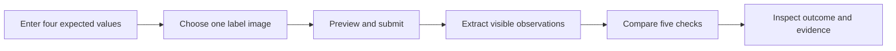
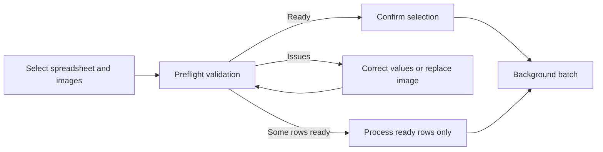
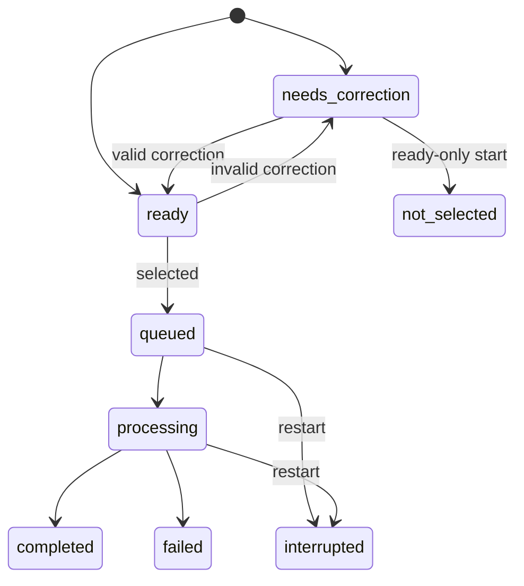

# Workflows

**Status:** P0 and bounded P1 implemented

**Last updated:** 2026-08-12

## Single-label review

The expected values are brand name, class/type, ABV, and net contents. The Government Warning uses
the canonical wording and observable style requirements rather than another manually entered value.
One JPEG, PNG, or WebP may show a single label or a composite of relevant panels.

The result places one overall outcome before the five individual checks:

- `All checks passed` means all five checks match;
- `Needs review` means at least one field is different, ambiguous, unreadable, uncertain, or not
  visible; and
- `Unable to process` means validation or processing failed before a useful comparison completed.

Every check shows the expected value, visible candidate or candidates, normalized values when
applicable, and a short reason. The workflow makes no approval or rejection decision.

## Batch package

P1 accepts one XLSX workbook or UTF-8 CSV and up to 25 separately selected images. ZIP is not an
accepted input. The downloadable template has six exact columns in this order:

1. `Application ID`
2. `Label Image Filename`
3. `Expected Brand`
4. `Expected Class/Type`
5. `Expected ABV`
6. `Expected Net Contents`

The workflow is designed around ordinary spreadsheet and file selection rather than a technical
archive format. Filenames are trimmed, Unicode-normalized, and matched case-insensitively; ambiguous
collisions are rejected rather than selected automatically.

| Limit | Value |
| --- | ---: |
| Application rows | 25 |
| Selected images | 25 |
| Spreadsheet | 1 MiB |
| Each image | 10 MiB |
| Complete multipart package | 100 MiB |
| Absolute draft and result retention | 24 hours |

CSV uses strict UTF-8. XLSX parsing reads the exact `Batch` worksheet and rejects encrypted,
macro-enabled, externally linked, malformed, oversized, or expansion-heavy workbooks. Formulas are
not evaluated. Blank rows do not count toward the 25-case limit, while the inspected source span is
bounded to 250 rows.

## Preflight and correction

Preflight reports package, row, and image issues in plain language. It detects missing images,
unreferenced images, duplicate application IDs, duplicate references, ambiguous filenames, invalid
expected values, corrupt or unsupported images, and package limits. An unreferenced valid image is
a warning; errors prevent the affected case from becoming ready.

A structurally valid spreadsheet creates a recoverable draft even if every row needs correction.
The user can edit the four expected values or replace one row's image. Refresh recovers the draft
from its UUID in the URL. Retrieval and editing never extend the original 24-hour expiry.

Starting a batch always requires confirmation. If every row is ready, `all_cases` selects them. If
some rows still need correction, the user may explicitly select `ready_cases_only`; unselected rows
become terminal `not_selected` cases and receive no provider work.

## Processing and results

Each selected case enters the same P0 image, extraction, comparison, accounting, and cleanup
pipeline independently. Two workers may advance a batch, but they share the application's global
two-slot extraction ceiling with public single reviews.

A provider, capacity, validation, or application failure terminates only that case. Later cases
continue, and a batch containing failed cases can still become `completed`. Failed and interrupted
states are processing failures, not comparison outcomes and not `Needs review`.

The progress view counts selected cases reaching `completed`, `failed`, or `interrupted`. It shows
the full state breakdown and filters for all selected cases, `Needs review`, failed/interrupted, and
all-checks-passed outcomes. Selecting a completed row opens the same five-check detail as P0;
failed or interrupted rows show expected values and a safe reason without fabricated checks.

Terminal results can be downloaded as a UTF-8 CSV. It includes case state, outcome, duration,
five check statuses, expected and extracted application fields, and a short reason. Full Government
Warning text is omitted, and user- or model-derived cells are neutralized against spreadsheet
formula execution.

## Failure and restart behavior

- Invalid content receives corrective preflight information without a provider call.
- Reusing a start idempotency key returns current state and creates no second job.
- A temporary polling failure backs off and retries without restarting the batch.
- Processed images are deleted after each terminal attempt.
- Unused draft images and results expire within 24 hours.
- Shutdown drains briefly; startup marks uncertain work interrupted and never replays extraction.
- Completed results remain readable until expiry.

## Supplied examples

The interface and [README](../README.md#reviewer-demo-files) link three P0 labels, blank CSV/XLSX
templates, a two-case valid package, and a mixed correction package. Their exact expected inputs,
preflight counts, outcomes, source revisions, and hashes are recorded in
[`fixtures/reviewer-demo-v1.json`](../fixtures/reviewer-demo-v1.json).

The HTTP representation is documented in [API](api.md), short-lived state in
[Storage](storage.md), and acceptance criteria in [Specification](specification.md).
